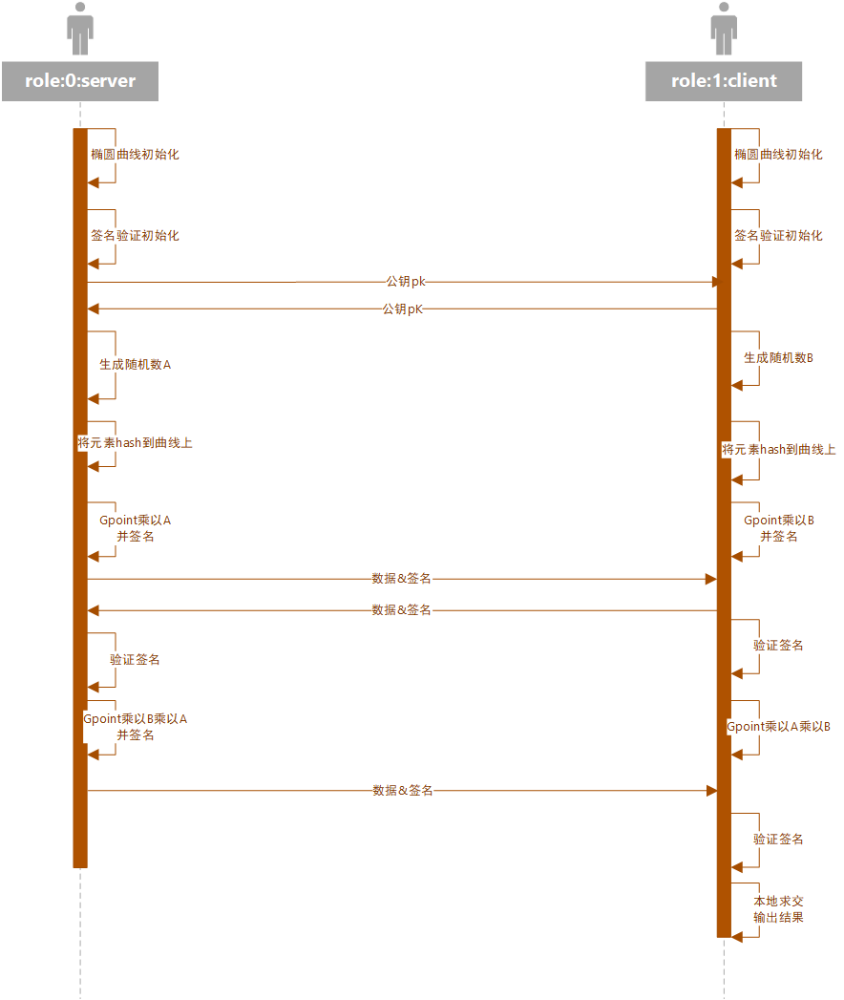

# Private Set Intersection (PSI)

## 说明
本仓库旨在使用国密SM2/SM3实现ecdh-psi，经测试，其一百万条PSI性能是encryptogroup ecdh-psi https://github.com/encryptogroup/PSI 的3倍。

## 环境&安装
本库需要gcc7.5以上的版本，make，ippcp，glib

## 时序图
#### psi-demo.cpp

#### dh-psi.cpp

#### sign&verify module

##运行截图

